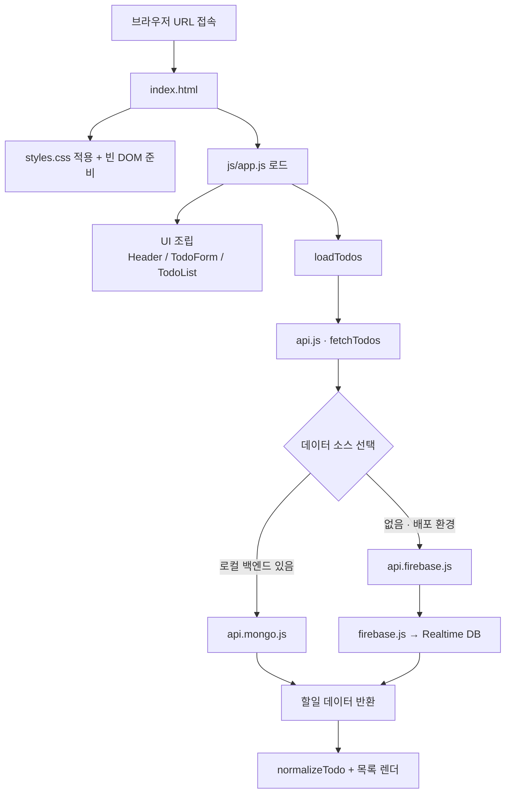

# 3-1 Todo App (Firebase)

바닐라 JS 할일(Todo) 앱입니다.  
로컬에 MongoDB 백엔드(`3-2-todo-app-backend`)가 있으면 그걸 쓰고, 없으면 Firebase Realtime Database로 동작합니다.

## Tech Stack

- HTML / CSS / Vanilla JS (ES Modules)
- Firebase Realtime Database
- (선택) Express + MongoDB 백엔드

## 실행 구조 (URL 접속 시)

브라우저가 URL을 열면 아래 순서로 코드가 실행됩니다.



### 쉽게 말하면

1. **`index.html`** — 페이지 뼈대를 만들고 `app.js`만 실행합니다.
2. **`app.js`** — 화면(헤더·입력폼·목록)을 붙인 뒤, 할일 목록을 불러옵니다.
3. **`api.js`** — Mongo 백엔드(`127.0.0.1:5000`)가 살아 있는지 확인하고, 없으면 Firebase를 고릅니다.
4. **`api.firebase.js` / `api.mongo.js`** — 실제로 데이터를 읽고 씁니다.
5. **`TodoList` 등 컴포넌트** — 받아온 데이터로 화면을 그립니다.

이후 추가·수정·삭제·완료 체크도 같은 경로입니다.  
UI 이벤트 → `app.js` → `api.js` → Firebase 또는 Mongo → 다시 목록 새로고침.

`?db=firebase` 또는 `?db=mongo`로 저장소를 강제로 지정할 수도 있습니다.

## Project Structure

```
3-1-todo-app-firebase/
├── index.html              # 진입점
├── styles.css
└── js/
    ├── app.js              # UI 조립 + 이벤트 + loadTodos
    ├── api.js              # 저장소 선택 + CRUD 라우터
    ├── api.firebase.js     # Firebase CRUD
    ├── api.mongo.js        # Mongo 백엔드 CRUD
    ├── firebase.js         # Firebase 초기화
    ├── utils.js
    └── components/
        ├── Header.js
        ├── TodoForm.js
        ├── TodoList.js
        └── TodoItem.js
```

## Getting Started

별도 빌드 없이 정적 파일로 실행할 수 있습니다.

1. 이 폴더를 로컬 서버로 엽니다. (Live Server, `npx serve` 등)
2. 브라우저에서 페이지에 접속합니다.
3. 백엔드 없이 열면 Firebase로 동작합니다.
4. Mongo를 쓰려면 `3-2-todo-app-backend`를 포트 `5000`에서 먼저 실행하세요.

## Note

`js/firebase.js`의 `firebaseConfig`(apiKey 등)는 Firebase 웹 클라이언트용 **공개 설정값**입니다.  
실제 데이터 보호는 Firebase Realtime Database **보안 규칙**과 API 키 **HTTP 리퍼러 제한**으로 합니다.
