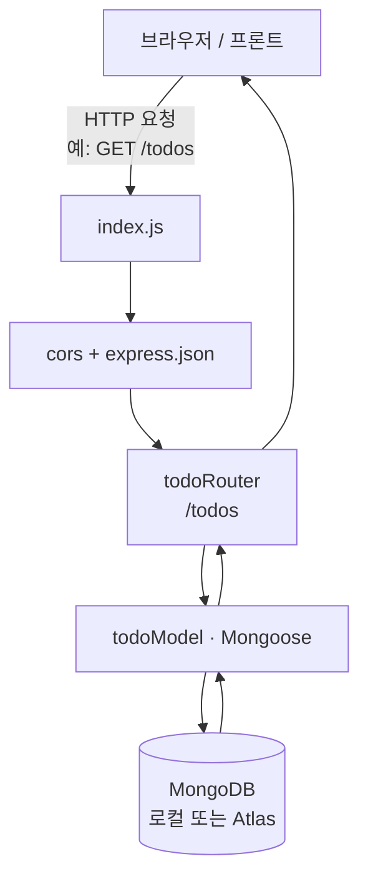
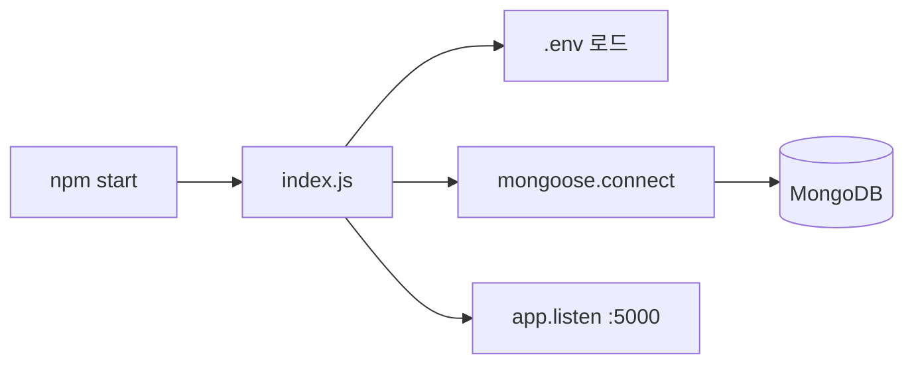

# 3-2 Todo App Backend

Express + MongoDB(Mongoose) 기반 할일(Todo) REST API 서버입니다.  
프론트엔드(`3-1-todo-app-firebase`, `3-3-todo-app-frontend` 등)에서 `http://localhost:5000/todos`로 호출해 사용할 수 있습니다.

## Tech Stack

- Node.js / Express
- MongoDB + Mongoose
- dotenv (환경변수)
- cors (프론트 교차 출처 요청 허용)

## 실행 구조 (URL 접속 시)

브라우저(또는 프론트)가 API URL을 호출하면 아래 순서로 처리됩니다.



서버가 켜질 때의 준비 과정은 이렇습니다.



### 쉽게 말하면

1. **프론트** — `http://localhost:5000/todos`로 목록 조회·추가·수정·삭제를 요청합니다.
2. **`index.js`** — CORS로 다른 포트 요청을 허용하고, JSON body를 읽은 뒤 `/todos`로 넘깁니다.
3. **`todoRouter.js`** — HTTP 메서드(GET/POST/PUT/DELETE)에 맞는 작업을 실행합니다.
4. **`todoModel.js`** — Mongoose로 MongoDB의 `todos` 컬렉션을 읽고 씁니다.
5. **응답** — 결과를 JSON으로 다시 프론트에 돌려줍니다.

즉, **화면 → Express(`/todos`) → MongoDB → JSON 응답** 한 줄입니다.

## Project Structure

```
3-2-todo-app-backend/
├── index.js              # 서버 진입점 (DB 연결, CORS, 라우터 등록)
├── models/
│   └── todoModel.js      # Todo 스키마
├── routers/
│   └── todoRouter.js     # /todos CRUD API
├── .env.example          # 환경변수 예시
├── .gitignore
└── package.json
```

## Getting Started

### 1. 의존성 설치

```bash
cd 3-2-todo-app-backend
npm install
```

### 2. 환경변수 설정

`.env.example`을 복사해 `.env`를 만들고 값을 채웁니다.

```bash
cp .env.example .env
```

| 변수 | 설명 | 기본값 |
|------|------|--------|
| `MONGO_URI` | MongoDB 연결 문자열 | `mongodb://localhost:27017/todo` |
| `PORT` | 서버 포트 | `5000` |

`MONGO_URI`를 비우거나 설정하지 않으면 로컬 MongoDB(`localhost:27017/todo`)로 연결됩니다.  
Atlas를 쓰려면 `.env`에 `mongodb+srv://...` 형태의 URI를 넣으면 됩니다.

### 3. 서버 실행

```bash
npm start
```

성공 시 콘솔에 MongoDB 연결 정보와 `서버가 포트 5000에서 실행 중입니다.` 메시지가 출력됩니다.

## API

Base URL: `http://localhost:5000/todos`

| Method | Path | 설명 |
|--------|------|------|
| `GET` | `/todos` | 할일 목록 조회 (최신순) |
| `GET` | `/todos/:id` | 할일 단건 조회 |
| `POST` | `/todos` | 할일 생성 (`{ "title": "..." }`) |
| `PUT` | `/todos/:id` | 할일 수정 (`title`, `completed`) |
| `DELETE` | `/todos/:id` | 할일 삭제 |

### 예시

```bash
# 목록 조회
curl http://localhost:5000/todos

# 생성
curl -X POST http://localhost:5000/todos \
  -H "Content-Type: application/json" \
  -d "{\"title\":\"강의 듣기\"}"

# 수정
curl -X PUT http://localhost:5000/todos/<id> \
  -H "Content-Type: application/json" \
  -d "{\"completed\":true}"

# 삭제
curl -X DELETE http://localhost:5000/todos/<id>
```

## Notes

- `.env`에는 DB 비밀번호 등 비밀값이 들어가므로 Git에 올리지 마세요 (`.gitignore`에 포함됨).
- 프론트와 포트가 다르므로 CORS가 설정되어 있습니다.

## License

Personal / learning project.