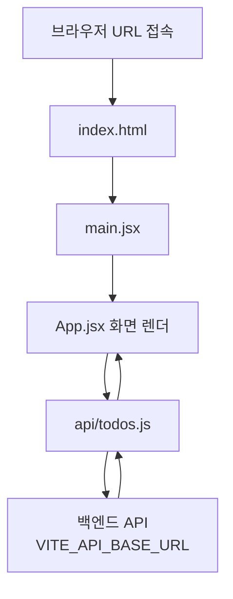

# 3-3 Todo App Frontend

React + Vite로 만든 할일(Todo) 프론트엔드입니다.  
화면에서 할일을 추가·수정·완료·삭제하고, API를 통해 백엔드와 통신합니다.

## 기술 스택

### 언어 / 마크업

| 구분 | 사용 |
|------|------|
| JavaScript (JSX) | 앱 로직 (`App.jsx`, `todos.js` 등) |
| HTML | 진입점 (`index.html`) |
| CSS | 스타일 (`App.css`, `index.css`) |

TypeScript는 사용하지 않습니다. (`@types/react` 등은 에디터 타입 힌트용)

### 프레임워크 / 런타임

| 이름 | 역할 |
|------|------|
| React 19 | UI 컴포넌트, 상태 (`useState` / `useEffect`) |
| Vite 8 | 개발 서버, 번들/빌드, `.env` 주입 |
| ES Modules | `import` / `export` 모듈 구조 |

### 주요 라이브러리

| 패키지 | 구분 | 역할 |
|--------|------|------|
| `react` | 의존성 | UI |
| `react-dom` | 의존성 | 브라우저 렌더 (`createRoot`) |
| `@vitejs/plugin-react` | 개발 | Vite에서 JSX/React 처리 |
| `oxlint` | 개발 | 린트 (`npm run lint`) |
| `@types/react`, `@types/react-dom` | 개발 | 에디터 타입 힌트 |

### 웹 API

| API | 역할 |
|-----|------|
| `fetch` | 백엔드 Todo API 호출 (`src/api/todos.js`) |
| `import.meta.env.VITE_API_BASE_URL` | Vite 환경변수로 API 주소 주입 |

라우터(React Router), 전역 상태관리(Redux 등), UI 키트, HTTP 클라이언트(axios)는 사용하지 않습니다.

## 주요 파일

| 파일 | 역할 |
|------|------|
| `index.html` | 앱 진입 HTML (`#root`) |
| `src/main.jsx` | React 앱을 `#root`에 마운트 |
| `src/App.jsx` | 할일 UI (조회·추가·수정·완료·삭제) |
| `src/api/todos.js` | 백엔드 API 호출 (`fetch`) |
| `.env` | `VITE_API_BASE_URL` 설정 (Git 제외) |
| `.env.example` | 환경변수 템플릿 (커밋용) |

## URL 접속 시 실행 / 호출 구조

브라우저에서 앱 URL에 접속하면 아래 순서로 동작합니다.



### 쉽게 보기

1. **브라우저**가 `index.html`을 불러옵니다.
2. `index.html`이 **`main.jsx`**를 실행합니다.
3. `main.jsx`가 **`App.jsx`**를 화면에 붙입니다.
4. `App.jsx`가 버튼/입력 같은 UI 동작을 처리하고, 데이터는 **`api/todos.js`**에 요청합니다.
5. `todos.js`가 `.env`의 **`VITE_API_BASE_URL`**로 백엔드에 `fetch` 요청을 보냅니다.  
   값이 없으면 `http://localhost:5000/todos`를 기본으로 사용합니다.
6. 백엔드 응답을 받아 다시 화면에 할일 목록을 보여줍니다.

즉, **화면(App) → API 모듈(todos.js) → 백엔드** 한 줄로 이어집니다.

## 환경변수

API 주소는 소스에 하드코딩하지 않고 `.env`에서 읽습니다.

```js
// src/api/todos.js
const API_BASE = import.meta.env.VITE_API_BASE_URL || 'http://localhost:5000/todos'
```

`.env` 예시 (Git에는 올리지 않음):

```env
# 로컬 백엔드
# VITE_API_BASE_URL=http://localhost:5000/todos

# 배포된 백엔드 (실제 URL은 .env에만 저장)
VITE_API_BASE_URL=https://your-backend.example.com/todos
```

- 실제 클라우드 URL은 `.env`에만 넣고, 레포에는 `.env.example`만 올립니다.
- `.env`를 바꾼 뒤에는 Vite를 재시작해야 반영됩니다.
- 프론트 배포 시에는 호스팅 환경변수에 `VITE_API_BASE_URL`을 설정하세요.

## 로컬 실행

```bash
cp .env.example .env   # 필요 시 백엔드 URL 수정
npm install
npm run dev
```

| 명령 | 설명 |
|------|------|
| `npm run dev` | 개발 서버 실행 |
| `npm run build` | 프로덕션 빌드 |
| `npm run preview` | 빌드 결과 미리보기 |
| `npm run lint` | Oxlint 검사 |
