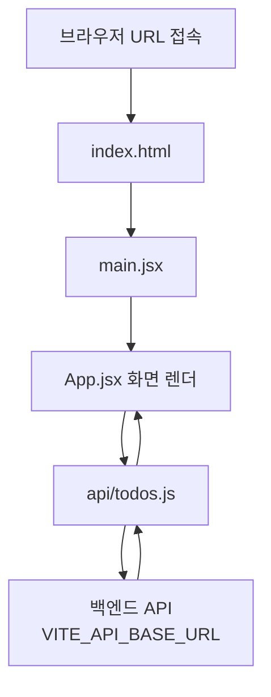

# 3-3 Todo App Frontend

React + Vite로 만든 할일(Todo) 프론트엔드입니다.  
화면에서 할일을 추가·수정·완료·삭제하고, API를 통해 백엔드와 주고합니다.

## URL 접속 시 실행 / 호출 구조

브라우저에서 앱 URL에 접속하면 아래 순서로 동작합니다.



### 쉽게 보기

1. **브라우저**가 `index.html`을 불러옵니다.
2. `index.html`이 **`main.jsx`**를 실행합니다.
3. `main.jsx`가 **`App.jsx`**를 화면에 붙입니다.
4. `App.jsx`가 버튼/입력 같은 UI 동작을 처리하고, 데이터는 **`api/todos.js`**에 요청합니다.
5. `todos.js`가 `.env`의 **`VITE_API_BASE_URL`**로 백엔드에 `fetch` 요청을 보냅니다.
6. 백엔드 응답을 받아 다시 화면에 할일 목록을 보여줍니다.

즉, **화면(App) → API 모듈(todos.js) → 백엔드** 한 줄로 이어집니다.

## 로컬 실행

```bash
npm install
npm run dev
```

`.env` 예시 (Git에는 올리지 않음):

```env
VITE_API_BASE_URL=http://localhost:5000/todos
```

배포 시에는 호스팅 환경변수에 같은 키로 백엔드 주소를 넣으면 됩니다.
